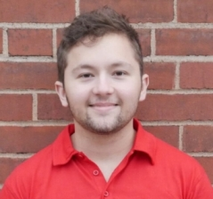

---
---

  

**Bio**
I'm a PhD candidate in robotics at CMU. I'm interested in teaching robotics, programming, and AI. My research interest is robots learning to plan with inaccurate models. 

**Education**

* **PhD Candidate in Robotics:** Carnegie Mellon University (Expected Dec 2024), Advisor: Oliver Kroemer
* **Master of Engineering in Computer Science:** Massachusetts Institute of Technology (MIT), Advisor: Leslie Kaelbing, 2019
* **Bachelor of Science in Computer Science:** Massachusetts Institute of Technology (MIT), 2018

**Contact**

* [Google Scholar](**https://scholar.google.com/citations?user=BeNOXOYAAAAJ&hl=en&oi=ao**)
* [LinkedIn](**https://www.linkedin.com/in/alex-lagrassa-47a30299/**)
* [Twitter](**https://twitter.com/alex_lagrassa**)

## Teaching Experience
**Black In Robotics (Summer 2023)**

* **Introductory Programming through Robotics (Instructor - Summer 2023)**: Developed curriculum (slides & web-based robot programming lab), co-taught lecture, and coordinated the lab with a team of TAs. This program introduced students to programming fundamentals through robot arm manipulation.

**Carnegie Mellon University (CMU)**

* **Planning and Decision-Making for Robotics (Teaching Assistant - Fall 2021)**: Updated and graded homework, wrote rubrics, developed an autograder, recorded lectures, held office hours, and managed Piazza
* **Statistical Techniques for Robotics (Teaching Assistant - Spring 2022)**: Updated homework including adding questions and rubrics, graded, developed an autograder, held office hours, reviewed scribe notes for half the lectures, and managed Piazza 

**Massachusetts Institute of Technology (MIT)**

* **Elements of Software Construction (Teaching Assistant - Spring 2018)**: Assisted students with code in lecture, check-offs, held office hours, graded, playtested homework, playtested in-class assessments, troubleshooted autograding issues, mentored ten project groups for a final project designing a large software project
* **Elements of Software Construction (Lab Assistant - Fall 2017)**: Playtested homework, held lab hours, graded code reviews. 
* **Foundations of Internet Policy (Teaching Assistant - Fall 2017 & Fall 2018)**: Coordinated activities, prepared materials, graded assignments, held office hours, and mentored research projects on Internet of Things policy

* **Educational Studies Program (2014-2021)**: Designed and led a 6-week lab-based course on learning programming through robot arm manipulation (co-taught with 2 instructors). Additionally, co-taught a 6-week introductory Python game programming course to Boston high school students, and developed courses on AI, programming, and formal verification delivered to middle and high school students over multiple weekends per year.

## Guest Lectures

* **CMU, Planning and Decision-Making for Robotics (Spring 2023)**: Delivered an 80-minute lecture on symbolic planning problems for undergraduates.
* **CMU, Robot Autonomy (Spring 2023)**: Presented an interactive 80-minute lecture on Markov Decision Processes for Masters students.
* **UCLA, Python with Applications II (Spring 2023)**: Led a 60-minute interactive lab-based session on robot arm manipulation and programming.
* **CMU, Planning and Decision-Making for Robotics (Fall 2022 & Spring 2022)**: Delivered interactive lectures on Policy Iteration, Value Iteration, and solving Markov Decision Processes for graduate students.
* **CMU, Planning and Decision-Making for Robotics (Fall 2021)**: Presented an interactive 80-minute lecture on Partially Observable Markov Decision Processes for graduate students.

## Service

I'm passionate about diversifying AI and robotics by improving representation in the field by facilitating hands-on practice in projects of students' interest.  

* **CMU, Paths to AI Research: Undergraduate Artificial Intelligence Mentoring (2019-Present):**
    * Main coordinator since Spring 2022, collaborating with a team to increase underrepresented group participation.
    * Developed a matching algorithm that connects students to mentors based on research interests and backgrounds.
    * Mentored undergraduate students from underrepresented groups in AI since Fall 2019.
    * Helped establish research connections for students with CMU labs and external collaborators.
    * [Website](https://sites.google.com/andrew.cmu.edu/ai-mentoring/home?authuser=0)

* **CMU, Girls of Steel (2020-Present):**
    * Mentored Girls of Steel robotics team in programming and media subteams.
    * Assisted the programming team with robot functionality implementation.

## Research 

### Planning with Inaccurate Models
* **Task-Oriented Active Learning of Model Preconditions for Inaccurate Dynamics Models (ICRA 2024)**. *A. LaGrassa, M. Lee, and O. Kroemer*  Algorithm for actively learning regions where a
 model is accurate.
  [Paper](https://arxiv.org/abs/2401.04007) [Website](https://arxiv.org/abs/2401.04007)
* **Focused Adaptation of Dynamics Models for Deformable Object Manipulation (ICRA 2023)**. *P. Mitrano, **A. LaGrassa**, O. Kroemer., and Dmitry Berenson*. Dynamics adaptation method that uses model deviation to focus learning dynamics to improve data efficiency. [Paper](https://ieeexplore.ieee.org/document/10161366)

* **Learning Model Preconditions for Planning with Multiple Models (CoRL 2021)**. *A. LaGrassa and O. Kroemer*.  Algorithm for learning where models deviation to plan using multiple inaccurate models. [Paper](https://proceedings.mlr.press/v164/lagrassa22a.html) 

* **Learning Skills to Patch Plans Based On Inaccurate Models (IROS 2020)** *A. LaGrassa, S. Lee, and O. Kroemer*. Method for combining model-based planning with model-free skills by learning skills where a model is inaccurate. [Paper](A. LaGrassa}, M. Lee, and O. Kroemer)

### Structure and Abstraction for Robot Learning

* **Search-Based Task Planning with Learned Skill Effect Models for Lifelong Robotic Manipulation (ICRA 2022)**. *J. Liang, M. Sharma, **A. LaGrassa**, and O. Kroemer*. Lifelong learning method for high-level skill models for task planning. [Paper](https://ieeexplore.ieee.org/abstract/document/9811575)

* **Learning Reactive and Predictive Differentiable Controllers for Switching Linear Dynamical Models (ICRA 2021)**. *S. Saxena, **A. LaGrassa**, and O. Kroemer.* Learning switching linear dynamical models and cost functions closed-loop controllers can use for contact-rich dynamic tasks. [Paper](https://ieeexplore.ieee.org/abstract/document/9561083)

* **Learning to compose hierarchical object-centric controllers for robotic manipulation (CoRL 2020)**. *M. Sharma, J. Liang, J. Zhao, **A. LaGrassa**, and O. Kroemer*. Combining primitive controllers based on controllers for more efficient reinforcement learning. [Paper](https://proceedings.mlr.press/v155/sharma21a.html)

